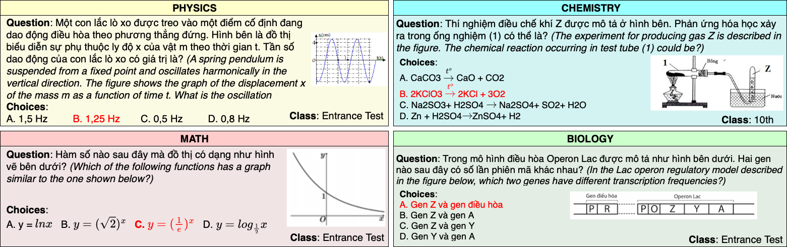

ViMURNASD - A Benchmark for Multimodal Understanding and Reasoning in Natural Scientific Diciplines
===

We represent a novel and large-scale benchmark for evaluating deep learning methods on Multimodal Understanding and Reasonin tasks in Natural Scientific Diciplines. This benchmark includes <> questions in four natural science diciplines: mathematics, physics, chemistry, and biology. These questions cover a wide range of knowledge for high school students from grade 10 to grade 12. Answers for these questions are provided in multiple-choice format and prepared by teachers and lecterers of six high school for the gifted in Ho Chi Minh city.

Paper for this benchmark are underreviwed. We will published this dataset upon the acceptance of this paper.

This project is undergoing under the instruction of the [UIT NLP Research Group](https://nlp.uit.edu.vn). For further information, please contact to the following authors:
- Phat Huu Dang. Email: [22521065@gm.uit.edu.vn](mailto:22521065@gm.uit.edu.vn).
- Phuoc Hoang Phan. Email: [22521156@gm.uit.edu.vn](mailto:22521156@gm.uit.edu.vn).
- Long Hoang Huu Nguyen. Email: [22520817@gm.uit.edu.vn](mailto:22520817@gm.uit.edu.vn).
- Nghia Hieu Nguyen. Email: [nghiangh@uit.edu.vn](mailto:nghiangh@uit.edu.vn).

